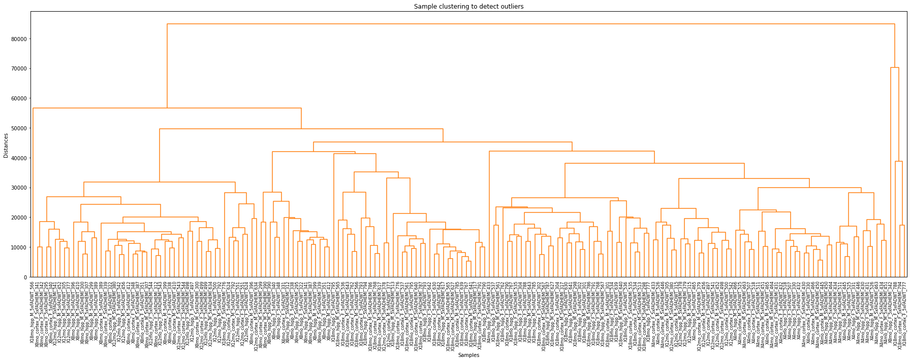
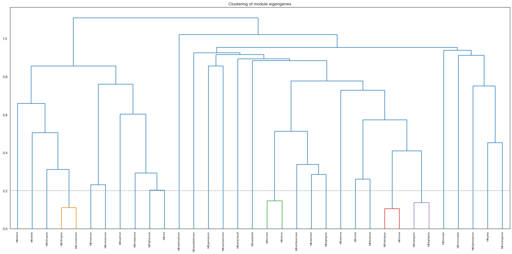
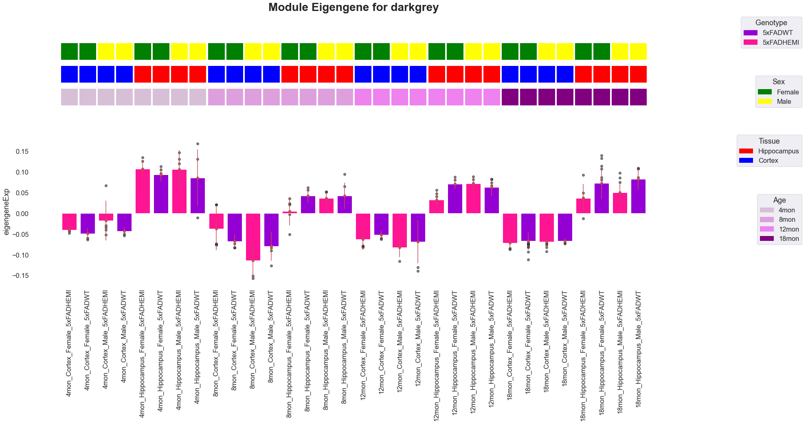
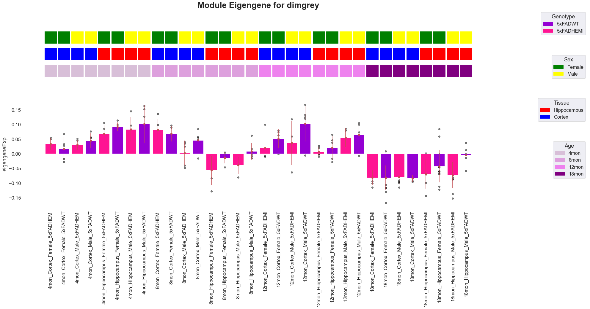
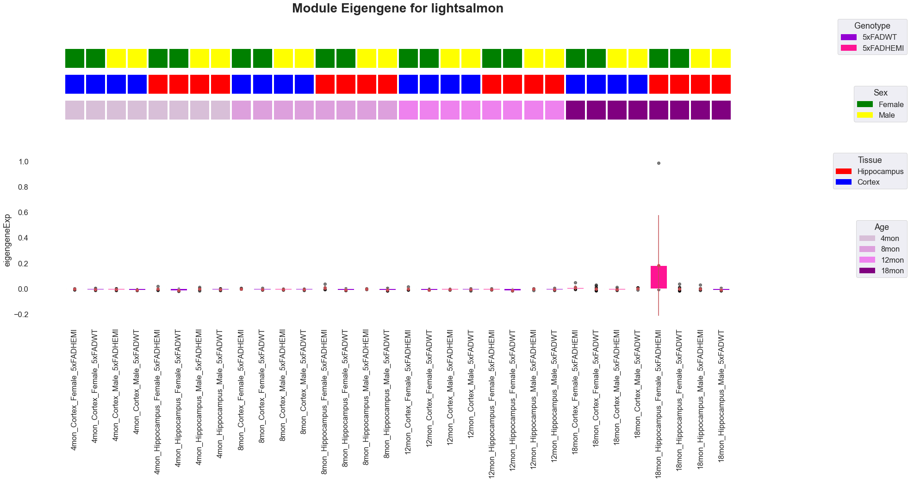
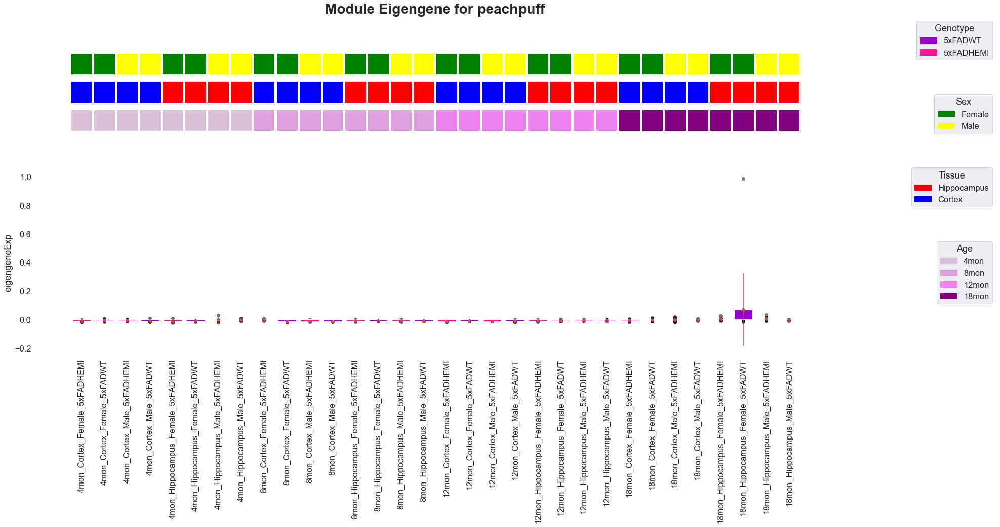
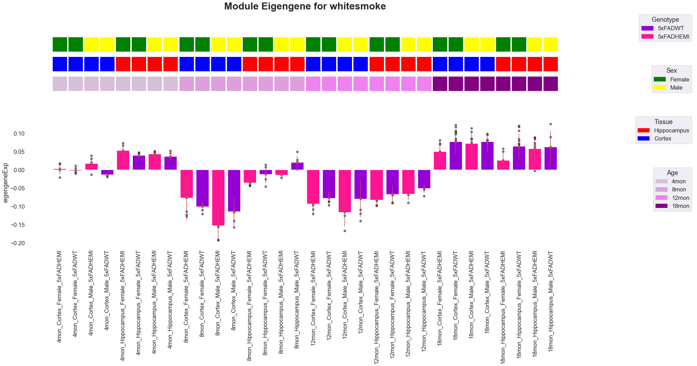

# Quick start: initializing, adding data, runing and saving your PyWGCNA

First, make sure to [install PyWGCNA](https://github.com/mortazavilab/PyWGCNA#readme).

I encourage you to look at [Data input, cleaning and pre-processing tutorial](Data%20format.md) before running PyWGCNA.

Then, download the data from [here](https://github.com/mortazavilab/PyWGCNA/raw/main/tutorials/5xFAD_paper.zip) and uncompressed it.

For this tutorial, we will be analyzing the TPM matrix of 5xFAD mouse from [MODEL-AD](https://www.model-ad.org/) portal and [this paper](https://www.nature.com/articles/s41597-021-01054-y) in Scientific Data which has 5548 genes and 193 samples in four different time point.

## Setupping up PyWGCNA object

We use the TPM matrix to create a PyWGCNA object. The object serves as a container that contains expression data (i.e. TPM) and analysis (like clustering, or visualizing results) for a RNA-seq dataset. For a technical discussion of the PyWGCNA object structure, check out our [GitHub Wiki](https://github.com/mortazavilab/PyWGCNA/wiki). For example, the raw TPM matrix is stored in `GeneExp` class as a anndata.


```python
import PyWGCNA
geneExp = '5xFAD_paper/expressionList_sorted.csv'
pyWGCNA_5xFAD = PyWGCNA.WGCNA(name='5xFAD', species='mouse', geneExpPath=geneExp, save=True)
pyWGCNA_5xFAD.geneExpr.to_df().head(5)
```

    Saving data to be True, checking requirements ...


<div>
<style scoped>
    .dataframe tbody tr th:only-of-type {
        vertical-align: middle;
    }

    .dataframe tbody tr th {
        vertical-align: top;
    }

    .dataframe thead th {
        text-align: right;
    }
</style>
<table border="1" class="dataframe">
  <thead>
    <tr style="text-align: right;">
      <th></th>
      <th>ENSMUSG00000000003.15</th>
      <th>ENSMUSG00000000028.15</th>
      <th>ENSMUSG00000000031.16</th>
      <th>ENSMUSG00000000037.16</th>
      <th>ENSMUSG00000000049.11</th>
      <th>ENSMUSG00000000056.7</th>
      <th>ENSMUSG00000000058.6</th>
      <th>ENSMUSG00000000078.7</th>
      <th>ENSMUSG00000000085.16</th>
      <th>ENSMUSG00000000088.7</th>
      <th>...</th>
      <th>ENSMUSG00000118383.1</th>
      <th>ENSMUSG00000118384.1</th>
      <th>ENSMUSG00000118385.1</th>
      <th>ENSMUSG00000118386.1</th>
      <th>ENSMUSG00000118387.1</th>
      <th>ENSMUSG00000118388.1</th>
      <th>ENSMUSG00000118389.1</th>
      <th>ENSMUSG00000118390.1</th>
      <th>ENSMUSG00000118391.1</th>
      <th>ENSMUSG00000118392.1</th>
    </tr>
  </thead>
  <tbody>
    <tr>
      <th>X4mo_cortex_F_5xFADHEMI_430</th>
      <td>0.0</td>
      <td>1.90</td>
      <td>0.00</td>
      <td>0.13</td>
      <td>0.43</td>
      <td>22.370001</td>
      <td>24.240000</td>
      <td>19.320000</td>
      <td>33.410000</td>
      <td>620.450012</td>
      <td>...</td>
      <td>0.75</td>
      <td>0.0</td>
      <td>0.00</td>
      <td>0.00</td>
      <td>0.0</td>
      <td>0.0</td>
      <td>0.0</td>
      <td>0.0</td>
      <td>0.04</td>
      <td>0.0</td>
    </tr>
    <tr>
      <th>X4mo_cortex_F_5xFADHEMI_431</th>
      <td>0.0</td>
      <td>1.10</td>
      <td>0.06</td>
      <td>0.07</td>
      <td>0.18</td>
      <td>16.990000</td>
      <td>24.690001</td>
      <td>23.879999</td>
      <td>31.400000</td>
      <td>705.729980</td>
      <td>...</td>
      <td>0.67</td>
      <td>0.0</td>
      <td>0.55</td>
      <td>0.43</td>
      <td>0.0</td>
      <td>0.0</td>
      <td>0.0</td>
      <td>0.0</td>
      <td>0.00</td>
      <td>0.0</td>
    </tr>
    <tr>
      <th>X4mo_cortex_F_5xFADHEMI_433</th>
      <td>0.0</td>
      <td>1.18</td>
      <td>0.07</td>
      <td>0.13</td>
      <td>1.90</td>
      <td>20.370001</td>
      <td>28.059999</td>
      <td>21.330000</td>
      <td>32.139999</td>
      <td>699.500000</td>
      <td>...</td>
      <td>0.91</td>
      <td>0.0</td>
      <td>0.00</td>
      <td>0.19</td>
      <td>0.0</td>
      <td>0.0</td>
      <td>0.0</td>
      <td>0.0</td>
      <td>0.02</td>
      <td>0.0</td>
    </tr>
    <tr>
      <th>X4mo_cortex_F_5xFADHEMI_434</th>
      <td>0.0</td>
      <td>2.18</td>
      <td>0.00</td>
      <td>0.07</td>
      <td>0.31</td>
      <td>17.980000</td>
      <td>21.459999</td>
      <td>15.060000</td>
      <td>27.600000</td>
      <td>639.950012</td>
      <td>...</td>
      <td>0.11</td>
      <td>0.0</td>
      <td>0.00</td>
      <td>0.00</td>
      <td>0.0</td>
      <td>0.0</td>
      <td>0.0</td>
      <td>0.0</td>
      <td>0.00</td>
      <td>0.0</td>
    </tr>
    <tr>
      <th>X4mo_cortex_F_5xFADHEMI_511</th>
      <td>0.0</td>
      <td>1.50</td>
      <td>0.10</td>
      <td>0.14</td>
      <td>0.53</td>
      <td>18.350000</td>
      <td>20.180000</td>
      <td>18.660000</td>
      <td>26.430000</td>
      <td>640.549988</td>
      <td>...</td>
      <td>0.64</td>
      <td>0.0</td>
      <td>1.38</td>
      <td>0.00</td>
      <td>0.0</td>
      <td>0.0</td>
      <td>0.0</td>
      <td>0.0</td>
      <td>0.02</td>
      <td>0.0</td>
    </tr>
  </tbody>
</table>
<p>5 rows × 55448 columns</p>
</div>


## Pre-processing workflow

PyWGCNA allows you to easily preproces the data including removing genes with too many missing values or really low expressed across samples(in default we suggest to remove genes without any expression more than 1 TPM) and also removing samples with too many missing values or not matched with. keep in your mind you can change criteria of removing outlier genes or sample by changing `TPMcutoff` and `cut`


```python
pyWGCNA_5xFAD.preprocess()
```

    Pre-processing...
    	Detecting genes and samples with too many missing values...
    	Done pre-processing..
    


    

    


## Construction of the gene network and identification of modules

PyWGCNA compress all the steps of network construction and module detection in one function called `findModules` including:
1. Choosing the soft-thresholding power: analysis of network topology
2. Co-expression similarity and adjacency
3. Topological Overlap Matrix (TOM)
4. Clustering using TOM
5. Merging of modules whose expression profiles are very similar


```python
pyWGCNA_5xFAD.findModules()
```

    Run WGCNA...
    pickSoftThreshold: calculating connectivity for given powers...
    will use block size  1876
        Power  SFT.R.sq     slope truncated R.sq      mean(k)    median(k)  \
    0       1  0.368857 -0.481613       0.701585  2444.750755  2260.416617   
    1       2    0.7253  -0.99165       0.886361   840.665489   673.081242   
    2       3  0.791986 -1.194264       0.946969   385.685335   258.451266   
    3       4  0.835392   -1.3419       0.968446   207.404152   113.456084   
    4       5  0.853842 -1.472183       0.973346   123.232581    54.784481   
    5       6  0.870673 -1.553348       0.979584    78.455923    28.471239   
    6       7  0.886736 -1.600869       0.986635    52.572016    15.594822   
    7       8  0.896672 -1.639343       0.992373     36.65884     9.454046   
    8       9  0.903531 -1.677747       0.994643    26.397061      6.02443   
    9      10  0.906045 -1.706474       0.995895    19.521431     3.975959   
    10     11  0.905582 -1.731076       0.994806    14.767291     2.623921   
    11     13  0.914482 -1.751347       0.997466     8.941254     1.205108   
    12     15  0.912684 -1.771227       0.994189     5.759987     0.568044   
    13     17  0.912188 -1.774908       0.990829     3.905403     0.273242   
    14     19  0.907649 -1.774186       0.989457     2.766824     0.135454   
    
             max(k)  
    0   5665.102677  
    1   3009.058817  
    2   1916.810604  
    3   1332.762767  
    4     984.03682  
    5    752.959995  
    6    591.514189  
    7    475.817179  
    8    389.237529  
    9    322.823835  
    10   270.867414  
    11   196.222412  
    12   146.575347  
    13   112.189051  
    14    87.594343  
    Selected power to have scale free network is 9.
    calculating adjacency matrix ...
    	Done..
    
    calculating TOM similarity matrix ...
    	Done..
    
    Going through the merge tree...
    ..cutHeight not given, setting it to 0.996  ===>  99% of the (truncated) height range in dendro.


    Trying to set attribute `.var` of view, copying.


    	Done..
    
    Calculating 34 module eigengenes in given set...
    	Done..
    
    mergeCloseModules: Merging modules whose distance is less than 0.2
    fixDataStructure: data is not a Dictionary: converting it into one.
    multiSetMEs: Calculating module MEs.
      Working on set 1 ...
    Calculating 34 module eigengenes in given set...
    	Done..
    
    multiSetMEs: Calculating module MEs.
      Working on set 1 ...
    Calculating 33 module eigengenes in given set...
    	Done..
    
    multiSetMEs: Calculating module MEs.
      Working on set 1 ...
    Calculating 31 module eigengenes in given set...
    	Done..
    
    multiSetMEs: Calculating module MEs.
      Working on set 1 ...
    Calculating 30 module eigengenes in given set...
    	Done..
    
      Calculating new MEs...
    multiSetMEs: Calculating module MEs.
      Working on set 1 ...
    Calculating 30 module eigengenes in given set...
    	Done..
    
    Calculating 30 module eigengenes in given set...
    	Done..
    
    fixDataStructure: data is not a Dictionary: converting it into one.
    orderMEs: order not given, calculating using given set 0
    	Done running WGCNA..
    


    

    


    

    


We also can merge two previous steps by calling `runWGCNA()` function.

## Relating modules to external information and identifying important genes
PyWGCNA gather some important analysis after identifying modules in `analyseWGCNA()` function including:

1. Quantifying module–trait relationship 
2. Gene relationship to trait and modules

keep in your mind before start analysing don't forget to add any information you have about samples or genes.

For showing module relationship heatmap, PyWGCNA needs user to indicate color from [Matplotlib colors](https://matplotlib.org/stable/gallery/color/named_colors.html) for metadata by using `setMetadataColor()` function.

You also can select which data Trait in which order you wish to show in module eigen gene heatmap


```python
pyWGCNA_5xFAD.updateMetadata(path='5xFAD_paper/metaData', sep='\t')
# add color for metadata
pyWGCNA_5xFAD.setMetadataColor('Sex', {'Female': 'green',
                                       'Male': 'yellow'})
pyWGCNA_5xFAD.setMetadataColor('Genotype', {'5xFADWT': 'darkviolet',
                                            '5xFADHEMI': 'deeppink'})
pyWGCNA_5xFAD.setMetadataColor('Age', {'4mon': 'thistle',
                                       '8mon': 'plum',
                                       '12mon': 'violet',
                                       '18mon': 'purple'})
pyWGCNA_5xFAD.setMetadataColor('Tissue', {'Hippocampus': 'red',
                                          'Cortex': 'blue'})

geneList = PyWGCNA.getGeneList(dataset='mmusculus_gene_ensembl',
                               attributes=['ensembl_gene_id', 
                                           'external_gene_name', 
                                           'gene_biotype'])

pyWGCNA_5xFAD.analyseWGCNA(geneList=geneList)
```

    Analysing WGCNA...
    Calculating module trait relationship ...
    	Done..
    
    Adding (signed) eigengene-based connectivity (module membership) ...
    	Done..
    
    Updating gene information based on given gene list ...
    	Done..
    
    plotting module heatmap eigengene...
    	Done..
    
    plotting module barplot eigengene...
    	Done..
    
    doing Go term analysis for each module...
    Go_term directory does not exist!
    Creating Go_term directory!


    2022-05-03 15:32:54,782 Warning: No enrich terms using library GO_Biological_Process_2021 when cutoff = 0.5
    2022-05-03 15:33:16,098 Warning: No enrich terms using library GO_Biological_Process_2021 when cutoff = 0.5


    	Done..
    


    

    


    

    


    

    


    

    


    

    


    

    


    

    


    

    


    

    


    

    


    

    


    

    


    

    


    

    


    

    


    

    


    

    


    

    


    

    


    

    


    

    


    

    


    

    


    

    


    

    


    

    


    

    


    

    


    

    


    

    


    

    


## Saving and loading your PyWGCNA
you can save or load your PyWGCNA object with `saveWGCNA()` or `readWGCNA()` function.


```python
pyWGCNA_5xFAD.saveWGCNA()
```

    Saving WGCNA as 5xFAD.p


you can also load your PyWGCNA object with `readWGCNA()` function. you can download `5xFAD.p` from [Zendo](https://zenodo.org/record/6672453#.YrDS4LnMJhE).


```python
import PyWGCNA
pyWGCNA_5xFAD = PyWGCNA.readWGCNA("5xFAD.p")
```

    Reading 5xFAD WGCNA done!

