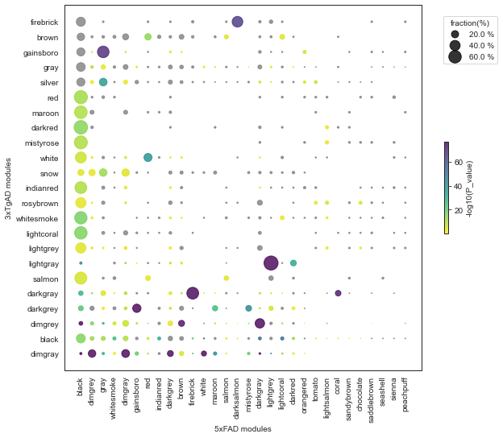

# Comparing two PyWGCNAs
you can also compare to pyWGCNA object to find out how each group of cluster is correlation with each others.
For achieving that, first you need to read your PyWGCNa object by `readWGCNA()` function.

## Read two PyWGCNA objects


```python
import sys
sys.path.insert(0, '/Users/nargesrezaie/Documents/MortazaviLab/PyWGCNA')

import PyWGCNA
pyWGCNA_5xFAD = PyWGCNA.readWGCNA("5xFAD.p")
pyWGCNA_3xTgAD = PyWGCNA.readWGCNA("3xTgAD_paper/3xTgAD.p")
```

    Reading 5xFAD WGCNA done!
    Reading 3xTgAD WGCNA done!


## Comparing two PyWGCNA objects
After reading the object you only need to call `compareWGCNA()` function on your two PyWGCNA, you can find the comparison results as a table in `comparison` variable.


```python
modelAD_5xFAD_3xTgAD = PyWGCNA.compareWGCNA(pyWGCNA_5xFAD, 
                                           pyWGCNA_3xTgAD)
modelAD_5xFAD_3xTgAD.comparison
```


<div>
<style scoped>
    .dataframe tbody tr th:only-of-type {
        vertical-align: middle;
    }

    .dataframe tbody tr th {
        vertical-align: top;
    }

    .dataframe thead th {
        text-align: right;
    }
</style>
<table border="1" class="dataframe">
  <thead>
    <tr style="text-align: right;">
      <th></th>
      <th>5xFAD</th>
      <th>3xTgAD</th>
      <th>5xFAD_size</th>
      <th>3xTgAD_size</th>
      <th>number</th>
      <th>fraction(%)</th>
      <th>P_value</th>
    </tr>
  </thead>
  <tbody>
    <tr>
      <th>0</th>
      <td>black</td>
      <td>dimgray</td>
      <td>6746</td>
      <td>5060</td>
      <td>97</td>
      <td>1.916996</td>
      <td>0.0</td>
    </tr>
    <tr>
      <th>1</th>
      <td>black</td>
      <td>black</td>
      <td>6746</td>
      <td>8157</td>
      <td>2497</td>
      <td>30.611745</td>
      <td>0.0</td>
    </tr>
    <tr>
      <th>2</th>
      <td>black</td>
      <td>dimgrey</td>
      <td>6746</td>
      <td>2966</td>
      <td>160</td>
      <td>5.394471</td>
      <td>0.0</td>
    </tr>
    <tr>
      <th>3</th>
      <td>black</td>
      <td>darkgrey</td>
      <td>6746</td>
      <td>479</td>
      <td>44</td>
      <td>9.185804</td>
      <td>0.0</td>
    </tr>
    <tr>
      <th>4</th>
      <td>black</td>
      <td>darkgray</td>
      <td>6746</td>
      <td>507</td>
      <td>40</td>
      <td>7.889546</td>
      <td>0.0</td>
    </tr>
    <tr>
      <th>...</th>
      <td>...</td>
      <td>...</td>
      <td>...</td>
      <td>...</td>
      <td>...</td>
      <td>...</td>
      <td>...</td>
    </tr>
    <tr>
      <th>685</th>
      <td>peachpuff</td>
      <td>white</td>
      <td>54</td>
      <td>162</td>
      <td>1</td>
      <td>0.617284</td>
      <td>0.29925</td>
    </tr>
    <tr>
      <th>686</th>
      <td>peachpuff</td>
      <td>mistyrose</td>
      <td>54</td>
      <td>67</td>
      <td>0</td>
      <td>0.0</td>
      <td>1.0</td>
    </tr>
    <tr>
      <th>687</th>
      <td>peachpuff</td>
      <td>darkred</td>
      <td>54</td>
      <td>76</td>
      <td>0</td>
      <td>0.0</td>
      <td>1.0</td>
    </tr>
    <tr>
      <th>688</th>
      <td>peachpuff</td>
      <td>maroon</td>
      <td>54</td>
      <td>81</td>
      <td>1</td>
      <td>1.234568</td>
      <td>0.162647</td>
    </tr>
    <tr>
      <th>689</th>
      <td>peachpuff</td>
      <td>red</td>
      <td>54</td>
      <td>70</td>
      <td>0</td>
      <td>0.0</td>
      <td>1.0</td>
    </tr>
  </tbody>
</table>
<p>690 rows × 7 columns</p>
</div>


## Ploting comparison
You can also plot the comparison result as a confusion matrix by using `plotCompareWGCA()` function.


```python
modelAD_5xFAD_3xTgAD.plotCompareWGCA(save=True)
```


    

    


```python
modelAD_5xFAD_3xTgAD.saveComparison()
```

    Saving comparison as comparison.p


```python
import PyWGCNA
modelAD_5xFAD_3xTgAD = PyWGCNA.readComparison('comparison.p')
```

    Reading comparison done!

